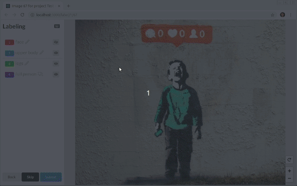
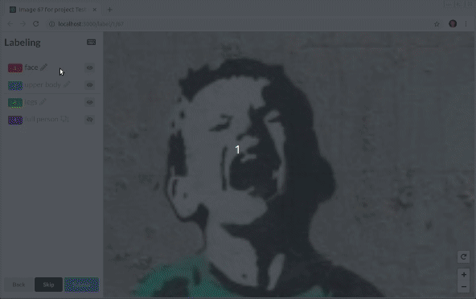
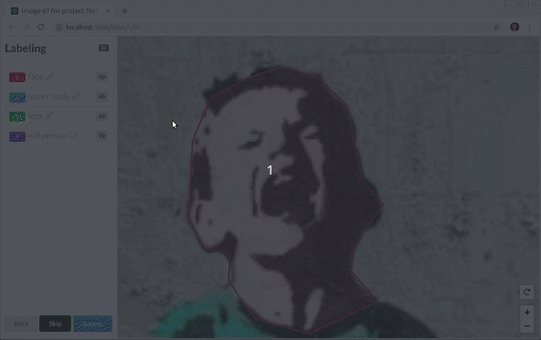
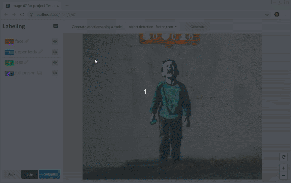
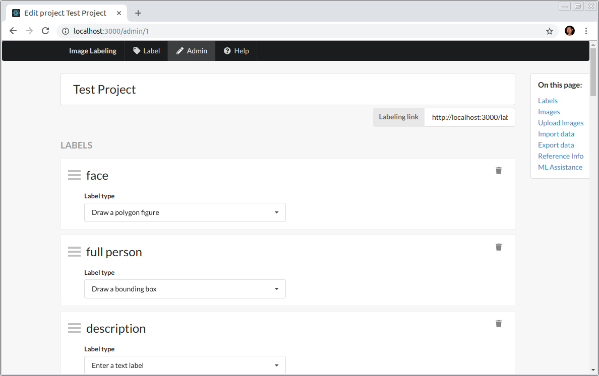

<center>

# 기술스택 🛠

## FrontEnd

<div style={display:flex}>


<div>

---

## Backend

<div style={display:flex}>


<div>
---

</center>

## 데이터 라벨링











---

## 기타 관리자 페이지

| 제목    | 내용    | 설명    |
| ------- | ------- | ------- |
| 테스트1 | _강조1_ | 테스트3 |

## Prerequisites

1. Clone the repo

```bash
git clone https://github.com/JJehyun/Data-Labeling-Platform.git
```

2. Install packages

```bash
yarn install
cd server && yarn install && cd ..
cd client && yarn install && cd ..
```

3. client build & run project

```bash
env PORT=3000 API_PORT=3001 yarn start
```

## Build For Production

Build the client app:

```bash
cd client && yarn run build && cd ..
```

```bash
env PORT=80 NODE_ENV=production node server/src/index.js
```

## Run in Docker

The default `Dockerfile` points to `/uploads` and `/db/db.sqlite` for persisted data, make sure to prepare those in advance to be mounted over. Here is an example mounting a local host directory:

```bash
mkdir ~/containersmnt/
mkdir ~/containersmnt/db/
mkdir ~/containersmnt/uploads/
```

Now build the container:

```bash
docker build -t imslavko/image-labeling-tool .
```

Run attaching the mounts:

```bash
docker run -p 5000:3000 -u $(id -u):$(id -g) -v ~/containersmnt/uploads:/uploads -v ~/containersmnt/db:/db -d imslavko/image-labeling-tool
```

Access the site at `localhost:5000`.

### Run with docker-compose

- Checkout the `docker-compose.yml` for detailed configuration.
- Need to set & export environment variable CURRENT_UID before running.

```bash
# if it needs to build the docker image,
CURRENT_UID=$(id -u):$(id -g) docker-compose up -d --build

# if it only needs to run,
CURRENT_UID=$(id -u):$(id -g) docker-compose up -d
```

## Project Support and Development

This project has been developed as part of my internship at the [NCSOFT](http://global.ncsoft.com/global/) Vision AI Lab in the beginning of 2019.
